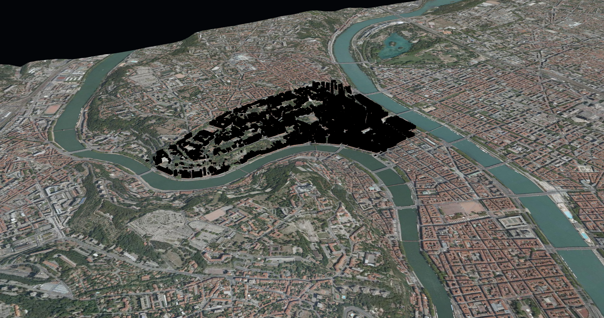
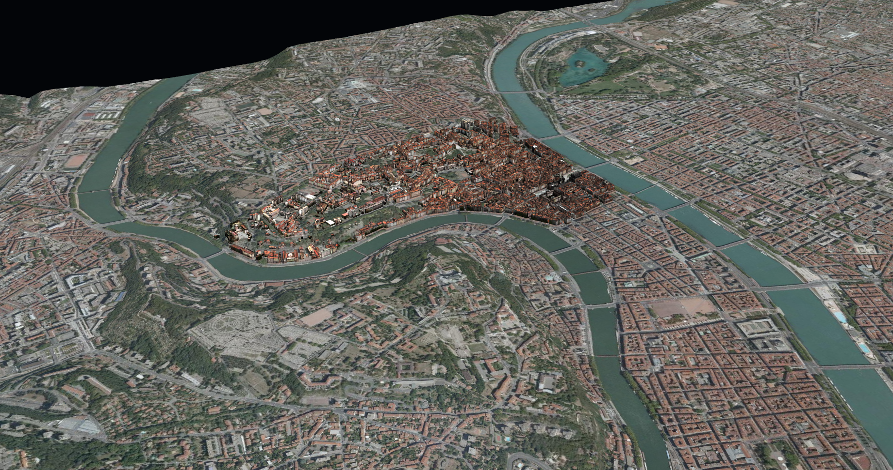

The goal of this tutorial is to learn how to visualize 3D tiles textured mesh data (in the b3dm format). 
We will use a [data set](https://github.com/iTowns/iTowns2-sample-data/tree/master/3DTiles/lyon_1_3946_textured_draco) representing buildings of the 1st borrough of Lyon.
The original data are openly available on [Lyon metropolis open data](https://data.grandlyon.com/) and have been transformed in 3D tiles with [py3dtilers](https://github.com/VCityTeam/py3dtilers/).

## Preparing the webpage

The webpage we want to display data on should be structured as follows :
```html
<!DOCTYPE html>
<html>
    <head>
        <meta charset="UTF-8">
        <title>Display 3D Tiles b3dm dataset with iTowns</title>
        <style>
            html { height: 100%; }
            body { margin: 0; overflow: hidden; height: 100%; }
            #viewerDiv { margin: auto; height: 100%; width: 100%; padding: 0; }
            canvas { display: block }
        </style>
    </head>
    <body>
        <div id="viewerDiv"></div>
        <script src="../dist/itowns.js"></script>
        <script type="text/javascript">
            // Tutorial code should go here
        </script>
    </body>
</html>
```

To work as is, this web page should be placed in the `examples/` folder of [itowns](https://github.com/iTowns/itowns) but you can put it anywhere else as 
long as you have a local web server and that you adapt the link to itowns (`<script src="../dist/itowns.js"></script>`).


## Preparing the field

We will first create a view, add a layer with ortho images and a digital elevation model (DEM).
The 3D Tiles dataset we are using is in the `EPSG:3946` CRS, so we will use a `{@link PlanarView}` in this CRS to display it.

We won't go into the details of creating the view, adding the ortho images and the DEM. For more information on this part, see the [Raster visualization in Lambert Conformical conic projection]{@tutorial Raster-data-Lambert93} in which we do the same but in the `EPSG:2154` projection. You can use the following code that prepared the field with such data:

```js
    // Define crs projection that we will use (taken from https://epsg.io/3946, Proj4js section)
    itowns.proj4.defs('EPSG:3946', 
    '+proj=lcc +lat_1=45.25 +lat_2=46.75 +lat_0=46 +lon_0=3 +x_0=1700000 +y_0=5200000 +ellps=GRS80' + 
    '+towgs84=0,0,0,0,0,0,0 +units=m +no_defs');

    // Define geographic extent: CRS, min/max X, min/max Y
    var extent = new itowns.Extent( 'EPSG:3946',
        1837816.94334, 1847692.32501,
        5170036.4587, 5178412.82698);

    // `viewerDiv` will contain iTowns' rendering area (`<canvas>`)
    var viewerDiv = document.getElementById('viewerDiv');

    // Instanciate PlanarView*
    var cameraCoord = new itowns.Coordinates('EPSG:3946', 1841980,
        5175682, 3000)
    var view = new itowns.PlanarView(viewerDiv, extent, { placement: {
        coord: cameraCoord, heading: 30, range: 4000, tilt: 30 } });

    // Add a WMS imagery source
    var wmsImagerySource = new itowns.WMSSource({
        extent: extent,
        name: 'Ortho2009_vue_ensemble_16cm_CC46',
        url: 'https://download.data.grandlyon.com/wms/grandlyon',
        version: '1.3.0',
        crs: 'EPSG:3946',
        format: 'image/jpeg',
    });

    // Add a WMS imagery layer
    var wmsImageryLayer = new itowns.ColorLayer('wms_imagery', {
        updateStrategy: {
            type: itowns.STRATEGY_DICHOTOMY,
            options: {},
        },
        source: wmsImagerySource,
    });

    view.addLayer(wmsImageryLayer);

    // Add a WMS elevation source
    var wmsElevationSource = new itowns.WMSSource({
        extent: extent,
        url: 'https://download.data.grandlyon.com/wms/grandlyon',
        name: 'MNT2012_Altitude_10m_CC46',
        crs: 'EPSG:3946',
        width: 256,
        format: 'image/jpeg',
    });

    // Add a WMS elevation layer
    var wmsElevationLayer = new itowns.ElevationLayer('wms_elevation', {
        useColorTextureElevation: true,
        colorTextureElevationMinZ: 144,
        colorTextureElevationMaxZ: 622,
        source: wmsElevationSource,
    });

    view.addLayer(wmsElevationLayer);
```

## Adding the 3D Tiles Layer

The 3D Tiles dataset we are using in this example has a geometry that is compressed with 
[Draco compression](https://google.github.io/draco/) for better performances. Therefore, we need to enable the draco 
decoder:

```js
itowns.enableDracoLoader('./libs/draco/');
```

As for every data displayed in iTowns, we first need to define a data `Source`.
Our data is in the 3d-tiles format, so we can use iTowns `{@link C3DTilesSource}` : 

```js
const buildingsSource = new itowns.C3DTilesSource({
    url: 'https://raw.githubusercontent.com/iTowns/iTowns2-sample-data/master/' +
    '3DTiles/lyon_1_3946_textured_draco/tileset.json',
});
```

It is worth noting that the 3d-tiles data we want to display on a given `{@link View}` must be in the same Coordinates 
Reference System (CRS) as the `{@link View}`.
Here, our 3d-tiles data are in [RGF93 / CC46](https://epsg.io/3946) projection, just like our `{@link PlanarView}`.
This is the reason why we do not need to specify a `crs` parameter when instantiating our `{@link C3DTilesSource}`.

Now that the source of our data is set, we need to create a `{@link Layer}` which will contain the data.
To display 3d-tiles data, iTowns comes with a `{@link C3DTilesLayer}`, which we can use as such :

```js
const buildingsLayer = new itowns.C3DTilesLayer('buildings', {
    source: buildingsSource,
}, view);
itowns.View.prototype.addLayer.call(view, buildingsLayer);
```

When instantiating a `{@link C3DTilesLayer}`, we need to specify which `{@link View}` it is added to.
We also need to call the generic `addLayer` method from `{@link View}`, and not the specific one from 
`{@link PlanarView}`. 
This is because both 3d-tiles data and `{@link PlanarView}` have their own spatial subdivision. 
Therefore, 3d-tiles data must not use specific `{@link PlanarView}` spatial subdivision (which is by default the case when using the `addLayer` method of `PlanarView` or `GlobeView`).

The code above results in the following :



We can see our buildings, but they are all black.
In order to improve their visualisation, we can add light effects to our view.

## Add light effects

We can use ThreeJS [`DirectionalLight`](https://threejs.org/docs/index.html#api/en/lights/DirectionalLight) and 
[`AmbientLight`](https://threejs.org/docs/index.html#api/en/lights/AmbientLight) to add light effects to our view.
We just need to implement them as we would in any [ThreeJS](https://threejs.org/) application :

```js
const directionalLight = new itowns.THREE.DirectionalLight(0xffffff, 1);
directionalLight.position.set(-0.9, 0.3, 1);
directionalLight.updateMatrixWorld();
view.scene.add(directionalLight);

const ambientLight = new itowns.THREE.AmbientLight(0xffffff, 1);
view.scene.add(ambientLight);
```

We can now see our buildings with some light effects :



## Result

By reaching here, you are now able to display some mesh data in 3d-tiles format.
The final code to do so is the following :

```html
<!DOCTYPE html>
<html>
    <head>
        <meta charset="UTF-8">
        <title>Display 3D Tiles b3dm dataset with iTowns</title>
        <style>
            html { height: 100%; }
            body { margin: 0; overflow: hidden; height: 100%; }
            #viewerDiv { margin: auto; height: 100%; width: 100%; padding: 0; }
            canvas { display: block }
        </style>
    </head>
    <body>
        <div id="viewerDiv"></div>
        <script src="../dist/itowns.js"></script>
        <script type="text/javascript">
            // Define crs projection that we will use (taken from https://epsg.io/3946, Proj4js section)
            itowns.proj4.defs('EPSG:3946', 
            '+proj=lcc +lat_1=45.25 +lat_2=46.75 +lat_0=46 +lon_0=3 +x_0=1700000 +y_0=5200000 +ellps=GRS80' + 
            '+towgs84=0,0,0,0,0,0,0 +units=m +no_defs');

            // Define geographic extent: CRS, min/max X, min/max Y
            var extent = new itowns.Extent( 'EPSG:3946',
                1837816.94334, 1847692.32501,
                5170036.4587, 5178412.82698);

            // `viewerDiv` will contain iTowns' rendering area (`<canvas>`)
            var viewerDiv = document.getElementById('viewerDiv');

            // Instanciate PlanarView*
            var cameraCoord = new itowns.Coordinates('EPSG:3946', 1841980,
                5175682, 3000)
            var view = new itowns.PlanarView(viewerDiv, extent, { placement: {
                coord: cameraCoord, heading: 30, range: 4000, tilt: 30 } });

            // Add a WMS imagery source
            var wmsImagerySource = new itowns.WMSSource({
                extent: extent,
                name: 'Ortho2009_vue_ensemble_16cm_CC46',
                url: 'https://download.data.grandlyon.com/wms/grandlyon',
                version: '1.3.0',
                crs: 'EPSG:3946',
                format: 'image/jpeg',
            });

            // Add a WMS imagery layer
            var wmsImageryLayer = new itowns.ColorLayer('wms_imagery', {
                updateStrategy: {
                    type: itowns.STRATEGY_DICHOTOMY,
                    options: {},
                },
                source: wmsImagerySource,
            });

            view.addLayer(wmsImageryLayer);

            // Add a WMS elevation source
            var wmsElevationSource = new itowns.WMSSource({
                extent: extent,
                url: 'https://download.data.grandlyon.com/wms/grandlyon',
                name: 'MNT2012_Altitude_10m_CC46',
                crs: 'EPSG:3946',
                width: 256,
                format: 'image/jpeg',
            });

            // Add a WMS elevation layer
            var wmsElevationLayer = new itowns.ElevationLayer('wms_elevation', {
                useColorTextureElevation: true,
                colorTextureElevationMinZ: 144,
                colorTextureElevationMaxZ: 622,
                source: wmsElevationSource,
            });

            view.addLayer(wmsElevationLayer);

            // Add 3D Tiles layer
            // This 3D Tiles tileset uses the draco compression that is an
            // extension of gltf. We need to enable it.
            itowns.enableDracoLoader('./libs/draco/');

            const buildingsSource = new itowns.C3DTilesSource({
                url: 'https://raw.githubusercontent.com/iTowns/iTowns2-sample-data/' +
                'master/3DTiles/lyon_1_3946_textured_draco/tileset.json',
            });

            const buildingsLayer = new itowns.C3DTilesLayer('buildings', {
                source: buildingsSource,
            }, view);
            itowns.View.prototype.addLayer.call(view, buildingsLayer);

            const directionalLight = new itowns.THREE.DirectionalLight(0xffffff, 1);
            directionalLight.position.set(-0.9, 0.3, 1);
            directionalLight.updateMatrixWorld();
            view.scene.add(directionalLight);

            const ambientLight = new itowns.THREE.AmbientLight(0xffffff, 1);
            view.scene.add(ambientLight);
        </script>
    </body>
</html>
```
