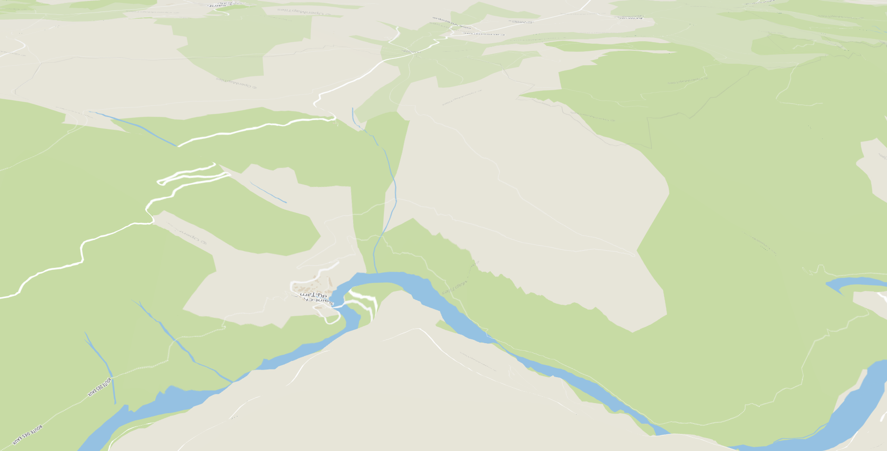
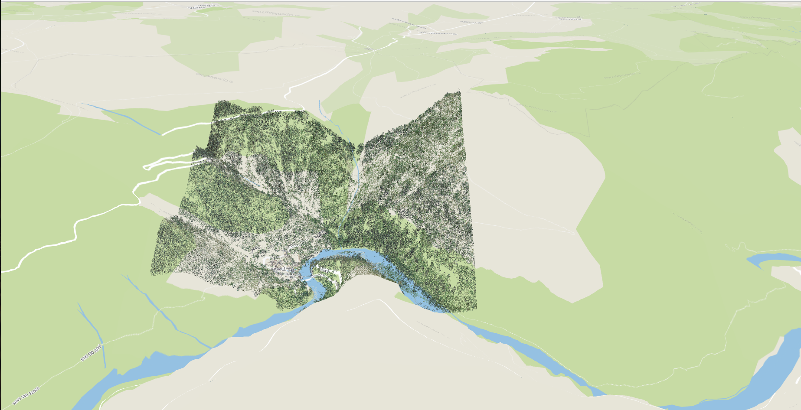
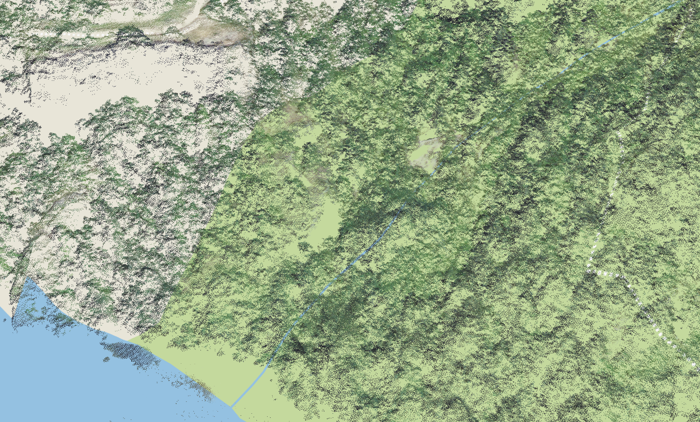
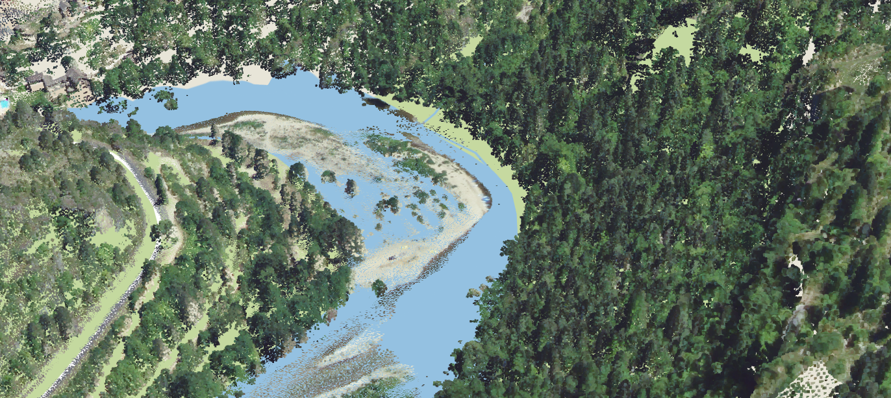

The goal of this tutorial is to learn how to visualize a 3D tiles point cloud (in the pnts format).
We will also learn how to modify the style of a 3D tiles dataset in itowns.
We will use a [data set](https://github.com/iTowns/iTowns2-sample-data/tree/master/3DTiles/dataset-dl.liris.cnrs.fr/three-d-tiles-lyon-metropolis/Lyon_2015_TileSet) representing a subset of the Tarn Gorges, initially provided by the [French Mapping Agency (IGN)](https://geoservices.ign.fr/lidarhd) and transformed in 3D tiles with [py3DTiles](https://gitlab.com/Oslandia/py3dtiles).

## Preparing the webpage

The webpage we want to display data on should be structured as follows :
```html
<!DOCTYPE html>
<html>
    <head>
        <meta charset="UTF-8">
        <title>Display 3D Tiles b3dm dataset with iTowns</title>
        <style>
            html { height: 100%; }
            body { margin: 0; overflow: hidden; height: 100%; }
            #viewerDiv { margin: auto; height: 100%; width: 100%; padding: 0; }
            canvas { display: block }
        </style>
    </head>
    <body>
        <div id="viewerDiv"></div>
        <script src="../dist/itowns.js"></script>
        <script type="text/javascript">
            // Tutorial code should go here
        </script>
    </body>
</html>
```

To work as is, this web page should be placed in the `examples/` folder of [itowns](https://github.com/iTowns/itowns) but you can put it anywhere else as 
long as you have a local web server and that you adapt the link to itowns (`<script src="../dist/itowns.js"></script>`).

## Preparing the field

We will first create a view, add a layer with ortho images and a digital elevation model (DEM).
The 3D Tiles dataset we are using is in the `EPSG:4978` CRS, so we will use a `{@link GlobeView}` to display it.

We won't go into the details of creating the view, adding the ortho images and the DEM. For more information on this part, see the [WGS84 tutorial]{@tutorial Raster-data-WGS84} in which we explain how to add similar layers. The only differences are the data sources used. Here, we use ortho images from a XYZ stream of Open Street Map tiles which will allow to better distinguish the point cloud. We also use a more precise DEM (but that only covers France).

```js
    var viewerDiv = document.getElementById('viewerDiv');
    var placement = {
        coord: new itowns.Coordinates('EPSG:4326', 3.3792, 44.3335, 844),
        tilt: 22,
        heading: -180,
        range: 2840
    };

    var view = new itowns.GlobeView(viewerDiv, placement);

    var orthoSource = new itowns.TMSSource({
        crs: "EPSG:3857",
        isInverted: true,
        format: "image/png",
        url: "http://osm.oslandia.io/styles/klokantech-basic/${z}/${x}/${y}.png",
        attribution: {
            name:"OpenStreetMap",
            url: "http://www.openstreetmap.org/"
        },
        tileMatrixSet: "PM"
    });

    var orthoLayer = new itowns.ColorLayer('Ortho', {
        source: orthoSource,
    });

    view.addLayer(orthoLayer);

    var elevationSource = new itowns.WMTSSource({
        url: 'http://wxs.ign.fr/3ht7xcw6f7nciopo16etuqp2/geoportail/wmts',
        crs: 'EPSG:4326',
        name: 'ELEVATION.ELEVATIONGRIDCOVERAGE.HIGHRES',
        tileMatrixSet: 'WGS84G',
        format: 'image/x-bil;bits=32',
        tileMatrixSetLimits: {
            11: {
                minTileRow: 442,
                maxTileRow: 1267,
                minTileCol: 1344,
                maxTileCol: 2683
            },
            12: {
                minTileRow: 885,
                maxTileRow: 2343,
                minTileCol: 3978,
                maxTileCol: 5126
            },
            13: {
                minTileRow: 1770,
                maxTileRow: 4687,
                minTileCol: 7957,
                maxTileCol: 10253
            },
            14: {
                minTileRow: 3540,
                maxTileRow: 9375,
                minTileCol: 15914,
                maxTileCol: 20507
            }
        }
    });

    var elevationLayer = new itowns.ElevationLayer('MNT_WORLD', {
        source: elevationSource,
    });

    view.addLayer(elevationLayer);
```

At this point you should be zoomed on the Tarn gorges (where our 3D dataset will be displayed) and see
a basemap and a 3D terrain:



## Adding the 3D Tiles Layer

As usual, we first configure a source. Here, we will use a `{@link C3DTilesSource}` for which it is as simple as giving the url of the dataset to display.

```js
    const pointCloudSource = new itowns.C3DTilesSource({
        url: 'https://raw.githubusercontent.com/iTowns/iTowns2-sample-data/' +
        'master/3DTiles/lidar-hd-gorges-saint-chely-tarn/tileset.json',
    });
```

Then, we create the `{@link C3DTilesLayer}` by giving it and `id`, the `source` and the `view`.
And finally we add it to the `{@link GlobeView}` by using the generic method of `{@link View}` to not
use the `GlobeView` subdivision (see [the 3D Tiles textured buildings tutorial](@tutorial 3DTiles-mesh-b3dm) for more information). 

```js
    const pointCloudLayer = new itowns.C3DTilesLayer('gorges', {
        source: pointCloudSource,
    }, view);
    itowns.View.prototype.addLayer.call(view, pointCloudLayer);
```

At this point, you should see the point cloud displayed:



However, if you zoom in, you will notice that the points a bit small:



In the next part, we will see how we can improve that.

## Updating 3D Tiles style

3D Tiles style can be changed on the fly when loading the 3D Tiles data in itowns. It can be done with
the `onTileContentLoaded` callback of `{@link C3DTilesLayer}` that is called for each tile when the content of a tile has been loaded. The tile content is a Threejs `Object3D` or `Group`, so we can access its material and make any style changes that we want. In our case, we will modify the size of the points.
First, we create a function to update the size of the point:

```js
    function updatePointCloudSize(tileContent) {
        tileContent.traverse(function (obj) {
            if (obj.isPoints) {
                obj.material.size = 3.0;
            }
        });
    }
```

In this function, we traverse the `tileContent` hierarchy until we find the threejs `Points` object with `obj.isPoints`. Then, we change the size of the threejs `PointMaterial` material. You can refer
to threejs documentation for more information on `Object3D`, `Group`, `Points` and `PointsMaterial` objects.

Then, we just need to pass this callback to the `{@link C3DTilesLayer}` constructor:

```js
    onTileContentLoaded: updatePointCloudSize
```

The constructor of the `{@link C3DTilesLayer}` therefore becomes:

```js
    const pointCloudLayer = new itowns.C3DTilesLayer('gorges', {
        source: pointCloudSource,
        onTileContentLoaded: updatePointCloudSize
    }, view);
```

If you zoom in to the points, you can now see that they are bigger:



Not that you can use this callback to change the style of any 3D Tiles dataset (even meshes) and to change any style property of the dataset.

## Result

The full code to achieve this result is:

```html
<!DOCTYPE html>
<html>
    <head>
        <meta charset="UTF-8">
        <title>Display 3D Tiles b3dm dataset with iTowns</title>
        <style>
            html { height: 100%; }
            body { margin: 0; overflow: hidden; height: 100%; }
            #viewerDiv { margin: auto; height: 100%; width: 100%; padding: 0; }
            canvas { display: block }
        </style>
    </head>
    <body>
        <div id="viewerDiv"></div>
        <script src="../dist/itowns.js"></script>
        <script type="text/javascript">
            var viewerDiv = document.getElementById('viewerDiv');
            var placement = {
                coord: new itowns.Coordinates('EPSG:4326', 3.3792, 44.3335, 844),
                tilt: 22,
                heading: -180,
                range: 2840
            };

            var view = new itowns.GlobeView(viewerDiv, placement);

            var orthoSource = new itowns.TMSSource({
                crs: "EPSG:3857",
                isInverted: true,
                format: "image/png",
                url: "http://osm.oslandia.io/styles/klokantech-basic/${z}/${x}/${y}.png",
                attribution: {
                    name:"OpenStreetMap",
                    url: "http://www.openstreetmap.org/"
                },
                tileMatrixSet: "PM"
            });

            var orthoLayer = new itowns.ColorLayer('Ortho', {
                source: orthoSource,
            });

            view.addLayer(orthoLayer);

            var elevationSource = new itowns.WMTSSource({
                url: 'http://wxs.ign.fr/3ht7xcw6f7nciopo16etuqp2/geoportail/wmts',
                crs: 'EPSG:4326',
                name: 'ELEVATION.ELEVATIONGRIDCOVERAGE.HIGHRES',
                tileMatrixSet: 'WGS84G',
                format: 'image/x-bil;bits=32',
                tileMatrixSetLimits: {
                    11: {
                        minTileRow: 442,
                        maxTileRow: 1267,
                        minTileCol: 1344,
                        maxTileCol: 2683
                    },
                    12: {
                        minTileRow: 885,
                        maxTileRow: 2343,
                        minTileCol: 3978,
                        maxTileCol: 5126
                    },
                    13: {
                        minTileRow: 1770,
                        maxTileRow: 4687,
                        minTileCol: 7957,
                        maxTileCol: 10253
                    },
                    14: {
                        minTileRow: 3540,
                        maxTileRow: 9375,
                        minTileCol: 15914,
                        maxTileCol: 20507
                    }
                }
            });

            var elevationLayer = new itowns.ElevationLayer('MNT_WORLD', {
                source: elevationSource,
            });

            view.addLayer(elevationLayer);

            const pointCloudSource = new itowns.C3DTilesSource({
                url: 'https://raw.githubusercontent.com/iTowns/iTowns2-sample-data/' +
                'master/3DTiles/lidar-hd-gorges-saint-chely-tarn/tileset.json',
            });

            function updatePointCloudSize(tileContent) {
                tileContent.traverse(function (obj) {
                    if (obj.isPoints) {
                        obj.material.size = 3.0;
                    }
                });
            }

            const pointCloudLayer = new itowns.C3DTilesLayer('gorges', {
                source: pointCloudSource,
                onTileContentLoaded: updatePointCloudSize
            }, view);
            itowns.View.prototype.addLayer.call(view, pointCloudLayer);
        </script>
    </body>
</html>
```