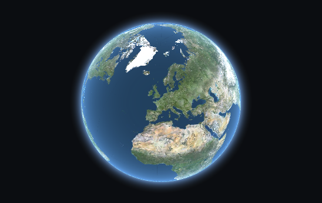

The goal of this tutorial is to give a brief example on how to use iTowns to
visualize a simple earth, with an elevation layer and a color layer.

## Preparing the webpage

```html
<!DOCTYPE html>
<html>
    <head>
        <meta charset="UTF-8">
        <title>Simple globe with iTowns</title>
        <style>
            html { height: 100%; }
            body { margin: 0; overflow: hidden; height: 100%; }
            #viewerDiv { margin: auto; height: 100%; width: 100%; padding: 0; }
            canvas { display: block }
        </style>
     </head>
     <body>
        <div id="viewerDiv"></div>
        <script src="js/itowns.js"></script>
        <script type="text/javascript">
            // Our code goes here
        </script>
     </body>
</html>
```

## Creating a view

In order to be able to display anything with iTowns, we need one thing: a view,
so we have a support to put our data on. The view needs to be attached to an
element of the page in order to be displayed.

```js
var viewerDiv = document.getElementById('viewerDiv');
var placement = {
    coord: new itowns.Coordinates('EPSG:4326', 2.35, 48.8),
    range: 25e6
};
var view = new itowns.GlobeView(viewerDiv, position);
```

Three things are done here. First we get the element of the page, on which the
view will be displayed. But getting this is not sufficient in our case to
display a globe view. [The documentation]{@link GlobeView} specifies that a
second parameter needs to be present: an object that will help place the camera
on the globe.

This object needs to contain two properties : a position which the camera is 
facing (`coord`), and a camera distance to target coordinates (`range`) in meters.
For the position argument, we can create a {@link Coordinates} in the WGS84 system -
whose EPSG code is 4326.

Then, having those two objects, the {@link GlobeView} can be created. It should
result in a simple blue globe like below.


## Adding a color layer

Now that we have a globe, let's display data on it. For this, let's use a basic
layer composed of aerial photos. To define this, we also need to describe our
source.

```js
var orthoSource = new itowns.WMTSSource({
    url: 'http://wxs.ign.fr/3ht7xcw6f7nciopo16etuqp2/geoportail/wmts',
    crs: 'EPSG:3857',
    name: 'ORTHOIMAGERY.ORTHOPHOTOS',
    tileMatrixSet: 'PM',
    format: 'image/jpeg',
});

var orthoLayer = new itowns.ColorLayer('Ortho', {
    source: orthoSource,
});

view.addLayer(orthoLayer);
```

We want to create and add a layer containing images. The best candidate here is
the {@link ColorLayer}. Looking at the documentation, we need at least one
parameter: the `id` of the layer. But that won't be enough to display data if we
don't tell the layer where to look to get the data. For achieving this, we can
declare a source in the options.

Images that we choose to display are coming from a WMTS server. So the source
used will be a {@link WMTSSource}. To declare this source, three elements are
needed:
- an `url`, describing the path to the WMTS service
- a `crs` projection in which to fetch the data
- a `name`, used to build the URL for each image
- a `tileMatrixSet`, for the same purpose

A `format` will also be specified in our case, as we are looking for jpeg
images.

Then, having all the necessary things, the layer can simply be created and added
to the view using [`addLayer`](View#addLayer). The result is as below.



## Adding an elevation layer

We can add more depth to the current globe by providing an elevation layer. The
process is quite similar to adding a `ColorLayer`. We are also still using a
`WMTSSource`, but it needs to be created again as it is different from the
previous one.

```js
var elevationSource = new itowns.WMTSSource({
    url: 'http://wxs.ign.fr/3ht7xcw6f7nciopo16etuqp2/geoportail/wmts',
    crs: 'EPSG:4326',
    name: 'ELEVATION.ELEVATIONGRIDCOVERAGE.SRTM3',
    tileMatrixSet: 'WGS84G',
    format: 'image/x-bil;bits=32',
    zoom: {min: 3, max: 10}
});

var elevationLayer = new itowns.ElevationLayer('MNT_WORLD', {
    source: elevationSource,
});

view.addLayer(elevationLayer);
```

Two things have changed:
- the layer created, which is an {@link ElevationLayer} instead
- the configuration, adapted to fit the source.

We also added a property `zoom` in the source configuration.
It contains the minimum and maximum values of the level, to zoom in the source.

Now we can zoom in and see some mountains !


## Result

Congratulations ! By reaching here, we are now able to display a simple globe
with an elevation layer and an color layer. Here is the final code:

```html
<!DOCTYPE html>
<html>
    <head>
        <meta charset="UTF-8">
        <title>Simple globe with iTowns</title>
        <style>
            html { height: 100%; }
            body { margin: 0; overflow: hidden; height: 100%; }
            #viewerDiv { margin: auto; height: 100%; width: 100%; padding: 0; }
            canvas { display: block }
        </style>
     </head>
     <body>
        <div id="viewerDiv"></div>
        <script src="js/itowns.js"></script>
        <script type="text/javascript">
            var viewerDiv = document.getElementById('viewerDiv');
            var placement = {
                coord: new itowns.Coordinates('EPSG:4326', 2.351323, 48.856712),
                range: 25000000
            };
            var view = new itowns.GlobeView(viewerDiv, placement);

            var orthoSource = new itowns.WMTSSource({
                url: 'https://wxs.ign.fr/3ht7xcw6f7nciopo16etuqp2/geoportail/wmts',
                crs: "EPSG:3857",
                name: 'ORTHOIMAGERY.ORTHOPHOTOS',
                tileMatrixSet: 'PM',
                format: 'image/jpeg',
            })

            var orthoLayer = new itowns.ColorLayer('Ortho', {
                source: orthoSource,
            });

            view.addLayer(orthoLayer);

            var elevationSource = new itowns.WMTSSource({
                url: 'https://wxs.ign.fr/3ht7xcw6f7nciopo16etuqp2/geoportail/wmts',
                crs: 'EPSG:4326',
                name: 'ELEVATION.ELEVATIONGRIDCOVERAGE.SRTM3',
                tileMatrixSet: 'WGS84G',
                format: 'image/x-bil;bits=32',
                zoom: {min: 3, max: 10},
            });

            var elevationLayer = new itowns.ElevationLayer('MNT_WORLD', {
                source: elevationSource,
            });

            view.addLayer(elevationLayer);
        </script>
     </body>
</html>
```
