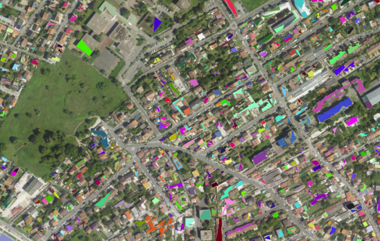
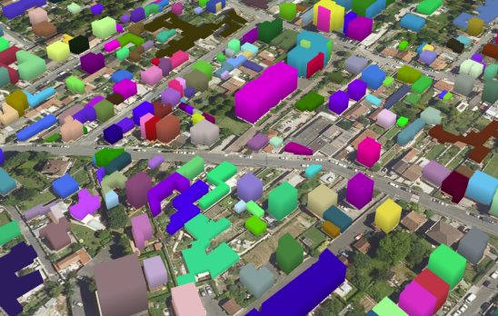
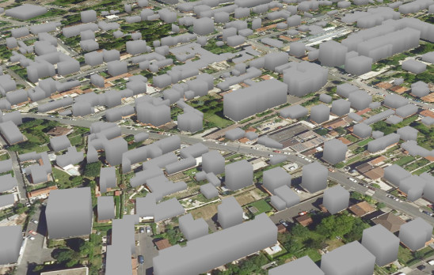

The goal of this tutorial is to give a brief example on how to use iTowns to
visualize some buildings on top of a simple globe view, using a geometry layer.

## Preparing the field

To display our buildings, we are going to use the data created in the {@tutorial
Create-a-simple-globe} tutorial. As we are trying to display some buildings,
let's move closer to the ground to see something. For this, change the starting
position to something more appropriate. We also need to modify the elevation
layer to a more precise one.

```html
<!DOCTYPE html>
<html>
    <head>
        <meta charset="UTF-8">
        <title>Simple globe with iTowns</title>
        <style>
            html { height: 100%; }
            body { margin: 0; overflow: hidden; height: 100%; }
            #viewerDiv { margin: auto; height: 100%; width: 100%; padding: 0; }
            canvas { display: block }
        </style>
     </head>
     <body>
        <div id="viewerDiv"></div>
        <script src="js/itowns.js"></script>
        <script type="text/javascript">
            var viewerDiv = document.getElementById('viewerDiv');
            var placement = {
                coord: new itowns.Coordinates('EPSG:4326', 2.35, 48.8),
                range: 1E3
            };
            var view = new itowns.GlobeView(viewerDiv, placement);
            
            var colorSource = new itowns.WMTSSource({
                url: 'http://wxs.ign.fr/3ht7xcw6f7nciopo16etuqp2/geoportail/wmts',
                crs: 'EPSG:3857',
                name: 'ORTHOIMAGERY.ORTHOPHOTOS',
                tileMatrixSet: 'PM',
                format: 'image/jpeg'
            });
            
            var colorLayer = new itowns.ColorLayer('Ortho', {
                source: colorSource,
            });
            
            view.addLayer(colorLayer);
            
            var elevationSource = new itowns.WMTSSource({
                url: 'http://wxs.ign.fr/3ht7xcw6f7nciopo16etuqp2/geoportail/wmts',
                crs: 'EPSG:4326',
                name: 'ELEVATION.ELEVATIONGRIDCOVERAGE.HIGHRES',
                tileMatrixSet: 'WGS84G',
                format: 'image/x-bil;bits=32',
                tileMatrixSetLimits: {
                    11: {
                        minTileRow: 442,
                        maxTileRow: 1267,
                        minTileCol: 1344,
                        maxTileCol: 2683
                    },
                    12: {
                        minTileRow: 885,
                        maxTileRow: 2343,
                        minTileCol: 3978,
                        maxTileCol: 5126
                    },
                    13: {
                        minTileRow: 1770,
                        maxTileRow: 4687,
                        minTileCol: 7957,
                        maxTileCol: 10253
                    },
                    14: {
                        minTileRow: 3540,
                        maxTileRow: 9375,
                        minTileCol: 15914,
                        maxTileCol: 20507
                    }
                }
            });
            
            var elevationLayer = new itowns.ElevationLayer('MNT_WORLD', {
                source: elevationSource,
            });
            
            view.addLayer(elevationLayer);
        </script>
     </body>
</html>
```

## Adding a GeometryLayer

We want to create and add a layer containing geometries. The best candidate here
is of course {@link GeometryLayer}. Reading the documentation, adding this type
of layer is similar to the other layers. So before declaring the layer, let's
instantiate the source.

```js
var geometrySource = new itowns.WFSSource({
    url: 'http://wxs.ign.fr/3ht7xcw6f7nciopo16etuqp2/geoportail/wfs?',
    typeName: 'BDTOPO_BDD_WLD_WGS84G:bati_indifferencie',
    crs: 'EPSG:4326',
});

var geometryLayer = new itowns.GeometryLayer('Buildings', new itowns.THREE.Group(), {
    source: geometrySource,
    update: itowns.FeatureProcessing.update,
    convert: itowns.Feature2Mesh.convert(),
    zoom: { min: 14 },
});

view.addLayer(geometryLayer);
```

There is a few differences though:
- the second parameter, `new itowns.THREE.Group()` in our case, is the
  `THREE.Object3d` the geometry will be attached to. Here we won't do something
  with it, so we can declare a simple anonymous object.
- the second parameter of the options is `update`: it is the method that will be
  called to update the layer each time the rendering loop is called. For now
  let's simply put `itowns.FeatureProcessing.update` and don't touch this
  method.
- the third parameter is `convert`, that is more interesting to us. It is the
  method that will tell how to use the data to convert it to meshes, and do
  other operations on it.

Trying this code will result in... nothing visually ! The data was processed and
displayed, but it is hidden under the elevation layer. If we remove the
elevation layer, we can see some shapes on the ground, indicating that buildings
have indeed been added. So let's place the data on the elevation layer !



## Placing the data on the ground

To achieve the positionning relative to the elevation layer, we will need to add
a parameter to the `convert` property: `altitude`, a method that will help us.

```js
function setAltitude(properties) {
    console.log(properties);
}

var geometrySource = new itowns.WFSSource({
    url: 'http://wxs.ign.fr/3ht7xcw6f7nciopo16etuqp2/geoportail/wfs?',
    typeName: 'BDTOPO_BDD_WLD_WGS84G:bati_indifferencie',
    crs: 'EPSG:4326',
});

var geometryLayer = new itowns.GeometryLayer('Buildings', new itowns.THREE.Group(), {
    source: geometrySource,
    update: itowns.FeatureProcessing.update,
    convert: itowns.Feature2Mesh.convert({
        altitude: setAltitude
    }),
    zoom: { min: 14 },
});

view.addLayer(geometryLayer);
```

If we take a look using `console.log(properties);` at what we have in the
`properties` object, we will get a lot of output. Our data being constitued of
multiple buildings, we get an output for each building. Looking closer to an
output, here is what we can obtain:

```js
geometry_name: "the_geom"
hauteur: 9
id: "bati_indifferencie.19138409"
origin_bat: "Cadastre"
prec_alti: 5
prec_plani: 2.5
z_max: 83.7
z_min: 83.7
```

Reading the documentation of the database we are querying ([section 9.1, page
84](http://professionnels.ign.fr/doc/DC_BDTOPO_3-0.pdf), in french), we have an
explanation on each property. To help us place the data correctly, let's use the
`z_min` property:

```js
function setAltitude(properties) {
    return properties.z_min;
}
```

And now the buildings are visible ! But if we take a look around by moving the
mouse, we'll see that the buildings are too high. It's due to the fact that the
`z_min` doesn't correspond exactly to the altitude of the building. To resolve
this problem, let's lower the altitude with the height of the building:

```js
function setAltitude(properties) {
    return properties.z_min - properties.hauteur;
}
```

But now we can't see completely our buildings again. What can we do about that
? Let's give them volume !


## Extruding the data

Like the altitude, the volume of a building can be changed using the `extrude`
parameter of the `convert` property.

```js
function setExtrusion(properties) {
    return properties.hauteur;
}

var geometrySource = new itowns.WFSSource({
    url: 'http://wxs.ign.fr/3ht7xcw6f7nciopo16etuqp2/geoportail/wfs?',
    typeName: 'BDTOPO_BDD_WLD_WGS84G:bati_indifferencie',
    crs: 'EPSG:4326',
});

var geometryLayer = new itowns.GeometryLayer('Buildings', new itowns.THREE.Group(), {
    source: geometrySource,
    update: itowns.FeatureProcessing.update,
    convert: itowns.Feature2Mesh.convert({
        altitude: setAltitude,
        extrude: setExtrusion,
    }),
    zoom: { min: 14 },
});

view.addLayer(geometryLayer);
```

The parameter `properties` of the `setExtrusion` method is the same that in
`setAltitude`. We notice there is a `hauteur` (`height` in french) property that
we could use to set the height of the building. Moving around with this gives a
nice view of our buildings:



## Coloring the data

We are not yet touching the color of the buildings. This results in every
building being randomly colored at each time. To solve this, as we did before,
we can add a `color` parameter to the `convert` property.

```js
function setColor(properties) {
    return new itowns.THREE.Color(0xaaaaaa);
}

var geometrySource = new itowns.WFSSource({
    url: 'http://wxs.ign.fr/3ht7xcw6f7nciopo16etuqp2/geoportail/wfs?',
    typeName: 'BDTOPO_BDD_WLD_WGS84G:bati_indifferencie',
    crs: 'EPSG:4326',
});

var geometryLayer = new itowns.GeometryLayer('Buildings', new itowns.THREE.Group(), {
    source: geometrySource,
    update: itowns.FeatureProcessing.update,
    convert: itowns.Feature2Mesh.convert({
        altitude: setAltitude,
        extrude: setExtrusion,
        color: setColor
    }),
    zoom: { min: 14 },
});

view.addLayer(geometryLayer);
```

For each building, a new color is created (using `THREE.Color`), and the result
here results in all buildings being in a light gray.



## Result

Congratulations ! By reaching here, we know how to display a simple geometry
layer on a globe, and change some things on this layer. Here is the final code:

```html
<!DOCTYPE html>
<html>
    <head>
        <meta charset="UTF-8">
        <title>Simple globe with iTowns</title>
        <style>
            html { height: 100%; }
            body { margin: 0; overflow: hidden; height: 100%; }
            #viewerDiv { margin: auto; height: 100%; width: 100%; padding: 0; }
            canvas { display: block }
        </style>
     </head>
     <body>
        <div id="viewerDiv"></div>
        <script src="../dist/itowns.js"></script>
        <script type="text/javascript">
            var viewerDiv = document.getElementById('viewerDiv');
            var placement = {
                coord: new itowns.Coordinates('EPSG:4326', 2.35, 48.8),
                range: 1E3
            };
            var view = new itowns.GlobeView(viewerDiv, placement);
            
            var colorSource = new itowns.WMTSSource({
                url: 'http://wxs.ign.fr/3ht7xcw6f7nciopo16etuqp2/geoportail/wmts',
                crs: 'EPSG:3857',
                name: 'ORTHOIMAGERY.ORTHOPHOTOS',
                tileMatrixSet: 'PM',
                format: 'image/jpeg'
            });
            
            var colorLayer = new itowns.ColorLayer('Ortho', {
                source: colorSource,
            });
            
            view.addLayer(colorLayer);
            
            var elevationSource = new itowns.WMTSSource({
                url: 'http://wxs.ign.fr/3ht7xcw6f7nciopo16etuqp2/geoportail/wmts',
                crs: 'EPSG:4326',
                name: 'ELEVATION.ELEVATIONGRIDCOVERAGE.HIGHRES',
                tileMatrixSet: 'WGS84G',
                format: 'image/x-bil;bits=32',
                tileMatrixSetLimits: {
                    11: {
                        minTileRow: 442,
                        maxTileRow: 1267,
                        minTileCol: 1344,
                        maxTileCol: 2683
                    },
                    12: {
                        minTileRow: 885,
                        maxTileRow: 2343,
                        minTileCol: 3978,
                        maxTileCol: 5126
                    },
                    13: {
                        minTileRow: 1770,
                        maxTileRow: 4687,
                        minTileCol: 7957,
                        maxTileCol: 10253
                    },
                    14: {
                        minTileRow: 3540,
                        maxTileRow: 9375,
                        minTileCol: 15914,
                        maxTileCol: 20507
                    }
                }
            });

            var elevationLayer = new itowns.ElevationLayer('MNT_WORLD', {
                source: elevationSource,
            });

            view.addLayer(elevationLayer);

            function setAltitude(properties) {
                return -properties.hauteur;
            }

            function setExtrusion(properties) {
                return properties.hauteur;
            }

            function setColor(properties) {
                return new itowns.THREE.Color(0xaaaaaa);
            }

            var geometrySource = new itowns.WFSSource({
                url: 'http://wxs.ign.fr/3ht7xcw6f7nciopo16etuqp2/geoportail/wfs?',
                typeName: 'BDTOPO_BDD_WLD_WGS84G:bati_indifferencie',
                crs: 'EPSG:4326',
            });

            var geometryLayer = new itowns.GeometryLayer('Buildings', new itowns.THREE.Group(), {
                source: geometrySource,
                update: itowns.FeatureProcessing.update,
                convert: itowns.Feature2Mesh.convert({
                    altitude: setAltitude,
                    extrude: setExtrusion,
                    color: setColor
                }),
                zoom: { min: 14 },
            });

            view.addLayer(geometryLayer);
        </script>
     </body>
</html>
```
