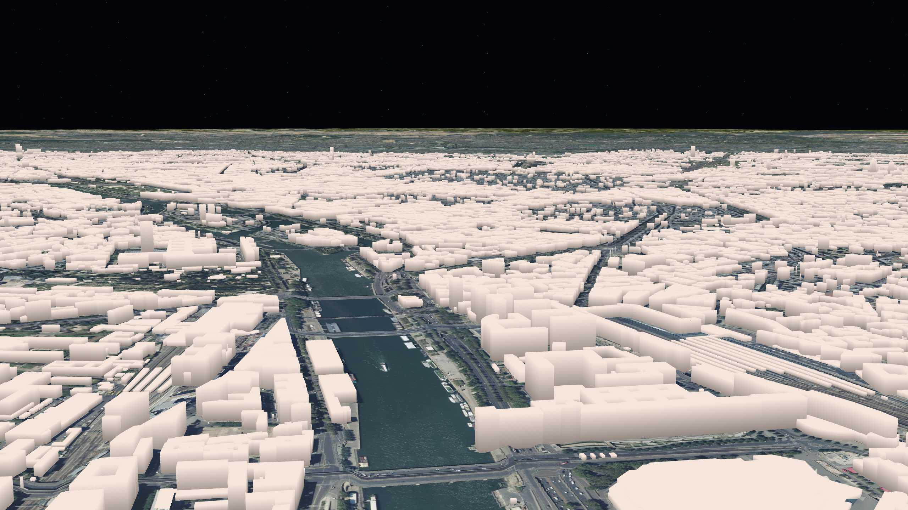
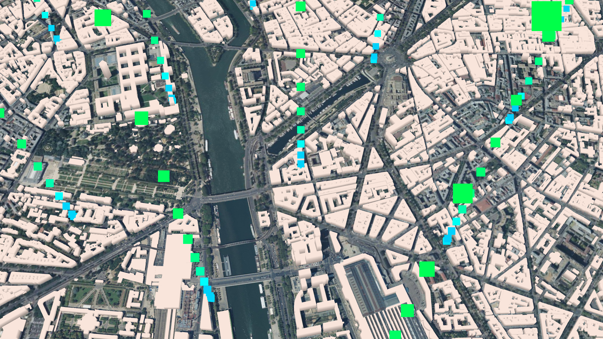

The goal of this tutorial is to display a spatial distribution of temperature measures, as it has been done in [this example](https://cboucheign.github.io/itowns-climate-example/#map_netcdf_temp).
This distribution is defined in [this GeoJSON file](https://github.com/cboucheIGN/itowns-climate-example/blob/master/data/lambert_O_paris_centre.geojson?short_path=7b8c8cf).
It shall be displayed in a local [RGF93 / Lambert 93](https://epsg.io/2154) Coordinates Reference System (CRS), on top of some ortho-images and some 3D buildings models.

## Preparing the field

For this tutorial, we are going to use a `PlanarView`, since we want our data to be displayed in a local CRS.
We can use the `PlanarView` we created in the [simple plan tutorial](Create-a-simple-plan.md). 
This view already displays some ortho-images, so we just have to add the buildings 3D models and the temperature data.
We need to change the geographic extent of our `PlanarView`, and we can also change the camera initial position.

```html
<!DOCTYPE html>
<html>
    <head>
        <meta charset="UTF-8">
        <title>Display temperature measures with iTowns</title>
        <style>
            html { height: 100%; }
            body { margin: 0; overflow: hidden; height: 100%; }
            #viewerDiv { margin: auto; height: 100%; width: 100%; padding: 0; }
            canvas { display: block }
        </style>
    </head>
    <body>
        <div id="viewerDiv"></div>
        <script src="js/itowns.js"></script>
        <script type="text/javascript">
    
            // Retrieve the view container
            const viewerDiv = document.getElementById('viewerDiv');
    
            // Define the view geographic extent
            itowns.proj4.defs(
                'EPSG:2154',
                '+proj=lcc +lat_1=49 +lat_2=44 +lat_0=46.5 +lon_0=3 +x_0=700000 +y_0=6600000 +ellps=GRS80 +towgs84=0,0,0,0,0,0,0 +units=m +no_defs'
            );
            const viewExtent = new itowns.Extent(
                'EPSG:2154',
                599500.0, 704499.99,
                6767500.0, 6922499.99,
            );
    
            // Define the camera initial placement
            const placement = {
                coord: new itowns.Coordinates('EPSG:2154', 653654.957, 6860967.684),
                tilt: 60,
                heading: -30,
                range: 2500,
            }
    
            // Create the planar view
            const view = new itowns.PlanarView(viewerDiv, viewExtent, {
                placement: placement,
            });
            view.tileLayer.maxSubdivisionLevel = 18;
            
            // Define the source of the ortho-images
            const sourceOrtho = new itowns.WMSSource({
                url: "https://wxs.ign.fr/3ht7xcw6f7nciopo16etuqp2/geoportail/r/wms",
                name: "HR.ORTHOIMAGERY.ORTHOPHOTOS",
                format: "image/png",
                crs: 'EPSG:2154',
                extent: viewExtent,
            });
            // Create the ortho-images ColorLayer and add it to the view
            const layerOrtho = new itowns.ColorLayer('Ortho', { source: sourceOrtho });
            view.addLayer(layerOrtho);
            
            // Define the source of the dem data
            const sourceDEM = new itowns.WMSSource({
                url: "https://wxs.ign.fr/3ht7xcw6f7nciopo16etuqp2/geoportail/r/wms",
                name: "ELEVATION.ELEVATIONGRIDCOVERAGE.HIGHRES",
                format: "image/x-bil;bits=32",
                crs: 'EPSG:2154',
                extent: viewExtent,
            });
            // Create the dem ElevationLayer and add it to the view
            const layerDEM = new itowns.ElevationLayer('DEM', { source: sourceDEM });
            view.addLayer(layerDEM);
        </script>
    </body>
</html>
```

If you take a close look to the code above, you will notice that we added this line :

```js
view.tileLayer.maxSubdivisionLevel = 18;
```

This is related to the way iTowns displays data. 
To make it simple : each view is subdivided in tiles.
When the camera is zoomed on a tile, this tile is subdivided in four tiles. 
These four tiles can be subdivided again if the camera is zoomed on them.
Doing this improves iTowns performance, as it allows for instance to only load full resolution images when the camera is zoomed enough to appreciate it.

The `maxSubdivisionLevel` is the maximum number of subsequent subdivisions that can occur on an initial tile (a tile when the camera is zoomed out at maximum).
Setting it to `18` increases its default value, allowing us to view more precise details when zooming in but reducing performance.
This is necessary here because of the data we are going to use, which require a higher subdivision number than usual to sharply display data when zooming in.

## Display some buildings 3D models

The process of displaying buildings 3D models on a `PlanarView` is the same as for a `GlobeView`, which was explained in the [geometry layer tutorial](Display-a-geometry-layer.md).
To summarize, we first need to define the source of our buildings 3D models data. 
Then we must create a `GeometryLayer` to support our data, and define three parameters of the layer's `convert` property :
- `altitude` to set our 3D models altitude,
- `extrude` to set our 3D models height (and thus give them volume),
- `color` to set the models color.

We shall thus display the buildings 3D models as such :

```js
// Define the source for the building vector data
const buildingSource = new itowns.WFSSource({
        url: 'https://wxs.ign.fr/3ht7xcw6f7nciopo16etuqp2/geoportail/wfs?',
        typeName: 'BDTOPO_BDD_WLD_WGS84G:bati_remarquable,BDTOPO_BDD_WLD_WGS84G:bati_indifferencie,BDTOPO_BDD_WLD_WGS84G:bati_industriel',
        crs: 'EPSG:4326',
    });

// Create the method to set buildings 3D models altitude :
function altitudeBuildings(properties) {
    return properties.z_min - properties.hauteur;
}
// Create the method to set buildings 3D models height :
function extrudeBuildings(properties) {
    return properties.hauteur;
}
// Create the method to set buildings 3D models color :
function colorBuildings(properties) {
    return new itowns.THREE.Color("rgb(247, 229, 218)");
}

// Create a GeometryLayer to display buildings 3D models and add it to the view
const buildingLayer = new itowns.GeometryLayer('Buildings', new itowns.THREE.Group(), {
    source: buildingSource,
    update: itowns.FeatureProcessing.update,
    convert: itowns.Feature2Mesh.convert({
        color: colorBuildings,
        altitude: altitudeBuildings,
        extrude: extrudeBuildings
    }),
    zoom: { min: 7 },
    overrideAltitudeInToZero: true,
});
view.addLayer(buildingLayer);
```

The `zoom` property allows defining an interval of subdivision numbers between which data from the layer shall be displayed.
Here, we specify that bellow the seventh subdivision, our buildings 3D models should not be displayed.

The result is the following : 


## Display a spatial distribution of temperature measures

Now that we have our `PlanarView` with ortho-images, a DEM and buildings 3D models displayed on it, we shall add our temperature data.
The process is roughly the same as for the buildings 3D models : we shall create a `GeometryLayer` from a given source, and modify its appearance with its `convert` parameters.

Our temperature data is contained within a GeoJSON file. We can therefore define their source as following :

```js
const temperatureSource = new itowns.FileSource({
    url: '{PATH TO THE TEMPERATURE DATA GEOJSON FILE}',
    crs: 'EPSG:2154',
    format: 'application/json',
});
```

You should obviously replace the `'{PATH TO THE TEMPERATURE DATA GEOJSON FILE}'` in the `url` by the actual path to the GeoJSON temperature file.


We can then create the `GeometryLayer` that shall support our temperature data :

```js
const temperatureLayer = new itowns.GeometryLayer('temperature', new itowns.THREE.Group(), {
    source: temperatureSource,
    update: itowns.FeatureProcessing.update,
    convert: itowns.Feature2Mesh.convert(),
});
view.addLayer(temperatureLayer);
```

Doing so adds a grid of points on the view, each point corresponding to the location of a temperature data.

You can notice we did not use the `overrideAltitudeInToZero` parameter when creating our `GeometryLayer` this time.
This is because we do not want our temperature data to be placed on the ground, as for the buildings.
The `overrideAltitudeInToZero` is thus set to its `false` default value, which means the points created for each temperature data shall be placed at their 3D position stored in the data file.

The result is shown bellow. 
The points added to the view are not well visible, especially when there are buildings or ortho-images behind them.
You will probably need to move around the view to be able to distinguish them.
You may still manage to see them in the dark areas outside the view, when there is no background.
This is because the points are too small, and we shall make them appearing bigger in the following part.



### Enlarge the temperature data

To make our temperature points look bigger, we can use a property of the `GeometryLayer`, which is called `onMeshCreated`.
As for the `altitude`, `extrude` or `color` parameters, the `onMeshCreated` property can define a method.
This method is applied to all the 3D object (meshes) in the `GeometryLayer` once they have been created.

We can use the `onMeshCreated` property as such :

```js
function enlargeTemperature(mesh) {
    mesh.material.size = 100;  // set the size of the 3D points (mesh)
}

const temperatureLayer = new itowns.GeometryLayer('temperature', new itowns.THREE.Group(), {
    source: temperatureSource,
    update: itowns.FeatureProcessing.update,
    convert: itowns.Feature2Mesh.convert(),
    onMeshCreated: enlargeTemperature,
});
view.addLayer(temperatureLayer);
```

Our temperature points are clearly visible in the `PlanarView` now :


### Color the temperature data

The last thing we need to do is to color our temperature data.
We wish each temperature point to be colored according to its effective temperature value.
To do so, we can use the `GeometryLayer` `color` parameter as such :

```js
const minimalTemp = 290;
const maximalTemp = 330;

function colorTemperature(property) {
    const blue = new itowns.THREE.Color("rgb(0, 0, 255)");
    const red = new itowns.THREE.Color("rgb(255, 0, 0)");
    const alpha = Math.min(255, Math.max(0, (property.temp - minimalTemp) / (maximalTemp - minimalTemp)));
    return blue.lerpHSL(red, alpha);
}

const temperatureLayer = new itowns.GeometryLayer('temperature', new itowns.THREE.Group(), {
    source: temperatureSource,
    update: itowns.FeatureProcessing.update,
    convert: itowns.Feature2Mesh.convert({
        color: colorTemperature,
    }),
    onMeshCreated: enlargeTemperature,
});
view.addLayer(temperatureLayer);
```

Several things are done here :
- We define a minimal and a maximal temperature, which in our case are 290K and 330K.
- For each temperature value in the data (stored in kelvins under the `temp` property), we define its point color as such :
    - if the point temperature is the minimal temperature or lower, its color shall be blue,
    - if the point temperature is the maximal temperature or higher, its color shall be red,
    - if the point temperature is between the minimal and maximal, its color shall be between blue and red. 
      The hotter the temperature, the redder its color.

The result should look like this :



## Result

Congratulations ! By reaching here, you are now able to display a spatial distribution of temperature measures on top of some ortho-images, a DEM and some buildings 3D models.
The complete code to do so is given bellow.

```html
<!DOCTYPE html>
<html>
    <head>
        <meta charset="UTF-8">
        <title>Display temperature measures with iTowns</title>
        <style>
            html { height: 100%; }
            body { margin: 0; overflow: hidden; height: 100%; }
            #viewerDiv { margin: auto; height: 100%; width: 100%; padding: 0; }
            canvas { display: block }
        </style>
    </head>
    <body>
        <div id="viewerDiv"></div>
        <script src="js/itowns.js"></script>
        <script type="text/javascript">
    
            // Retrieve the view container
            const viewerDiv = document.getElementById('viewerDiv');

            // Define the view geographic extent
            itowns.proj4.defs(
                'EPSG:2154',
                '+proj=lcc +lat_1=49 +lat_2=44 +lat_0=46.5 +lon_0=3 +x_0=700000 +y_0=6600000 +ellps=GRS80 +towgs84=0,0,0,0,0,0,0 +units=m +no_defs'
            );
            const viewExtent = new itowns.Extent(
                'EPSG:2154',
                599500.0, 704499.99,
                6767500.0, 6922499.99,
            );

            // Define the camera initial placement
            const placement = {
                coord: new itowns.Coordinates('EPSG:2154', 653654.957, 6860967.684),
                tilt: 60,
                heading: -30,
                range: 2500,
            }

            // Create the planar view
            const view = new itowns.PlanarView(viewerDiv, viewExtent, {
                placement: placement,
            });
            view.tileLayer.maxSubdivisionLevel = 18;

            // Define the source of the ortho-images
            const sourceOrtho = new itowns.WMSSource({
                url: "https://wxs.ign.fr/3ht7xcw6f7nciopo16etuqp2/geoportail/r/wms",
                name: "HR.ORTHOIMAGERY.ORTHOPHOTOS",
                format: "image/png",
                crs: 'EPSG:2154',
                extent: viewExtent,
            });
            // Create the ortho-images ColorLayer and add it to the view
            const layerOrtho = new itowns.ColorLayer('Ortho', { source: sourceOrtho });
            view.addLayer(layerOrtho);

            // Define the source of the dem data
            const sourceDEM = new itowns.WMSSource({
                url: "https://wxs.ign.fr/3ht7xcw6f7nciopo16etuqp2/geoportail/r/wms",
                name: "ELEVATION.ELEVATIONGRIDCOVERAGE.HIGHRES",
                format: "image/x-bil;bits=32",
                crs: 'EPSG:2154',
                extent: viewExtent,
            });
            // Create the dem ElevationLayer and add it to the view
            const layerDEM = new itowns.ElevationLayer('DEM', { source: sourceDEM });
            view.addLayer(layerDEM);

            // Define the source for the building vector data
            const buildingSource = new itowns.WFSSource({
                url: 'https://wxs.ign.fr/3ht7xcw6f7nciopo16etuqp2/geoportail/wfs?',
                typeName: 'BDTOPO_BDD_WLD_WGS84G:bati_remarquable,BDTOPO_BDD_WLD_WGS84G:bati_indifferencie,BDTOPO_BDD_WLD_WGS84G:bati_industriel',
                crs: 'EPSG:4326',
            });

            // Create the method to set buildings 3D models altitude :
            function altitudeBuildings(properties) {
                return properties.z_min - properties.hauteur;
            }
            // Create the method to set buildings 3D models height :
            function extrudeBuildings(properties) {
                return properties.hauteur;
            }
            // Create the method to set buildings 3D models color :
            function colorBuildings(properties) {
                return new itowns.THREE.Color("rgb(247, 229, 218)");
            }

            // Create a GeometryLayer to display buildings 3D models and add it to the view
            const buildingLayer = new itowns.GeometryLayer('Buildings', new itowns.THREE.Group(), {
                source: buildingSource,
                update: itowns.FeatureProcessing.update,
                convert: itowns.Feature2Mesh.convert({
                    color: colorBuildings,
                    altitude: altitudeBuildings,
                    extrude: extrudeBuildings
                }),
                zoom: { min: 7 },
                overrideAltitudeInToZero: true,
            });
            view.addLayer(buildingLayer);

            // Define the source for the temperature data
            const temperatureSource = new itowns.FileSource({
                url: '{PATH TO THE TEMPERATURE DATA GEOJSON FILE}',
                crs: 'EPSG:2154',
                format: 'application/json',
            });

            // Create the method to enlarge temperature points
            function enlargeTemperature(mesh) {
                mesh.material.size = 100;
            }

            // Create the method to color temperature points
            const minimalTemp = 290;
            const maximalTemp = 330;
            function colorTemperature(property) {
                const blue = new itowns.THREE.Color("rgb(0, 0, 255)");
                const red = new itowns.THREE.Color("rgb(255, 0, 0)");
                const alpha = Math.min(255, Math.max(0, (property.temp - minimalTemp) / (maximalTemp - minimalTemp)));
                return blue.lerpHSL(red, alpha);
            }

            // Create a GeometryLayer to display temperature points in 3D and add it to the view
            const temperatureLayer = new itowns.GeometryLayer('temperature', new itowns.THREE.Group(), {
                source: temperatureSource,
                update: itowns.FeatureProcessing.update,
                convert: itowns.Feature2Mesh.convert({
                    color: colorTemperature,
                }),
                onMeshCreated: enlargeTemperature,
            });
            view.addLayer(temperatureLayer);
        </script>
    </body>
</html>
```
