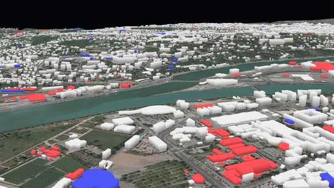

ITowns is a javascript framework for 3D geographic data visualisation. 
It can display a wide range of data such as ortho-images, Digital Elevation Models (DEM) or 3D models.

ITowns is based on [Three.js](https://threejs.org/), which is a javascript library that implements WebGL to render sophisticated 3D Geometry on a webpage.

In this tutorial, we shall be introduced to the fundamentals of iTowns : how it displays geographic data.

***

## Data visualization with iTowns

The support to display anything within iTowns is called a `View`.

To provide geographic data visualization, a `View` contains a combination of `Layers` which, in a digital map environment, are visual representations of any geographic data.
In other words, all data that are displayed using iTowns are supported by some `Layer`.

Each `View` in iTowns displays 3D data in a unique Coordinates Reference System (CRS). 
Yet, the data displayed within a `View` do not necessarily have to be in the `View`'s CRS.
ITowns comes with two pre-made `View` types : `GlobeView` and `PlanarView`. 
Each of these allows visualizing data from different types (raster or vector) and from different CRS.
On this matter, iTowns distinguishes two cases : 

- The first one regards data that are to be displayed as raster. 
  These data can either be original raster data or vector data whose representation is projected on the ground. 
  Data from this type are displayed in a `GlobeView` if their source CRS is [WGS 84](https://epsg.io/4326) or [Pseudo-Mercator](https://epsg.io/3857).
  However, if their source CRS defines a local projection (such as [RGF93 / Lambert 93](https://epsg.io/2154) for instance), they are displayed in a `PlanarView`.
- On another hand, vector data that are to be displayed as 3D objects can be displayed in any type of `View`, regardless of their source CRS.

It is important to aknowledge the following facts regarding original raster data and `Views` :
- a `GlobeView` allows displaying multiple raster data from two different source CRS : [WGS 84](https://epsg.io/4326) and [Pseudo-Mercator](https://epsg.io/3857),
- a `PlanarView` allows displaying multiple raster data, but all those data sources must have the same CRS.

Tutorials of how to create and use the two `View` types can be found [here]{@tutorial Raster-data-WGS84} for the `GlobeView` and [here]{@tutorial Raster-data-Lambert93} for the `PlanarView`.

***

## The data supported by iTowns

ITowns comes with a wide range of compatible data sources. 
It can be used to display data from web servers that use protocols such as Web Map (Tile) Service ([WMS](https://www.ogc.org/standards/wms) and [WMTS](https://www.ogc.org/standards/wmts)), Web Feature Service ([WFS](https://www.ogc.org/standards/wfs)) and Tile Map Service ([TMS](https://wiki.osgeo.org/wiki/Tile_Map_Service_Specification)).
Data from user given files can also be displayed.

Regarding data formats, iTowns offers several possibilities : [vector tile](https://docs.mapbox.com/help/glossary/vector-tiles/) resources from [MapBox](https://www.mapbox.com/), [Potree](https://github.com/potree/potree) 3D point clouds, oriented images, [GeoJSON](https://geojson.org/), [KML](https://www.ogc.org/standards/kml) or [GPX](https://www.topografix.com/gpx.asp).

***

## The support for visualized data

It was earlier mentioned that data are displayed as `Layers` within iTowns. 
Several specific types of `Layers` exist, the use of which depends on the data to display :

- `ColorLayer` can be used to display raster graphics or vector data projected on the ground (left picture in the table bellow),
- `ElevationLayer` can be used to display 3D elevation models (center picture in the table bellow),
- `GeometryLayer` can be used to display 3D objects, such as geometric shapes or buildings modelling (right picture in the table bellow).
- `FeatureGeometryLayer` is a pre-configured `GeometryLayer` which simplifies its implementation in given cases.
- `PointCloudLayer` can be used to display 3D point clouds.
- `OrientedImageLayer` can be used to display some oriented images.

|  |  |  |
| :---: | :---: | :---: |
| A simple `ColorLayer` is displayed | An `ElevationLayer` is added to represent terrain elevation | A `GeometryLayer` is added to model the buildings |

***

## Vector data appearance

ITowns can display vector data in two ways : the data can be displayed in a `View` as 3D objects, or as entities that are projected on the ground.
You can see bellow pictures illustrating the two cases.

|  |  |
| :---: | :---: |
| Vector data projected on the ground | Vector data display as 3D objects |

In both ways, the appearance and positioning of the vector data can be adjusted by modifying the `Style` parameter of the `Layer` the data are displayed in.
The `Style` in iTowns comes with several properties : 
- `fill` allows defining style rules for polygons interior,
- `stroke` allows defining style rules for lines and polygons edges,
- `point` allows defining style rules for points.

Each of these three properties comes with a bunch of parameters to set vector data appearance and positioning, such as `color`, `opacity`, `width`, `base_altitude`...
You can find a list of all the possible parameters in `Style` [documentation]{@link Style}.

These parameters can be set as static values or as functions of the vector data properties.
For example, let's suppose some vector data contains polygons.
Setting `fill.color` to `red` will color all the polygons in red.
If on another hand, all polygons come with a `color` property within the vector data, you can access it within `Style` in two ways :
- either by using brackets, which in our example results in setting `fill.color` to `'{color}'` ;
- or by passing a method to the `fill.color` value. 
  The first parameter of this method will automatically be an object containing all the properties of the vector data.
  In our example, the method could simply return the `color` property.

ITowns offers the possibility to display labels attached to points.
The content and appearance of the labels can be set the same way as for the polygons, lines and points : using a `Style` property which is called `text`.
For instance, setting `text.field` to `'{name}'` will display a label on each point that has a `name` property within the vector data.
The content of the label will be the content stored in the data under the `name` property.

### Vector data projected on the ground

When vector data are flattened on the ground, they are displayed in a `ColorLayer`. 
In that case, the data basically consist in polygons, lines or points.
Their appearance can be adjusted by modifying the `Style` of the `ColorLayer`. 
Yet, their positioning can't be modified since it is computed so that tey appear projected on the ground.

Tutorial on how to modify the appearance of some vector data displayed on the ground can be found [here]{@tutorial Vector-data-on-ground}.

### Vector data displayed as 3D objects

In the case of vector data represented as 3D objects, the data are displayed in a `GeometryLayer`.
The appearance and positioning of the vector data can be adjusted by modifying the `Style` of the `GeometryLayer`.
Two parameters allow modifying the data position :
- `base_altitude` which defines the altitude at the base of the 3D objects ;
- `extrusion_height` which defines the height of the 3D objects, giving them volume.

For example, given a set of polygons, setting `fill.base_altitude` to `500` and `fill.extrusion_height` to `20` will render extruded polygon expanding between 500 and 520 meters of altitude.

You can find tutorial on how to use the `base_altitude` and `extrusion_height` parameters [here]{@tutorial Vector-data-3d}.
