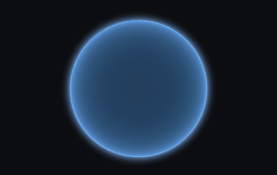
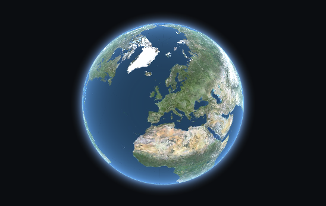
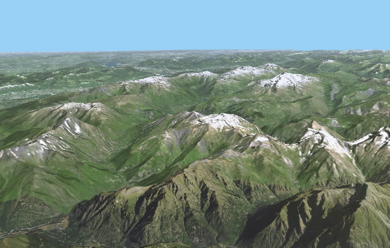

The goal of this tutorial is to give an example on how to use iTowns to visualize data in a global geocentric Coordinate Reference System (CRS).
It shows how to display ortho-images as well as a Digital Elevation Model (DEM).
## Preparing the webpage

The webpage we want to display data on should be structured as follows :
```html
<!DOCTYPE html>
<html>
    <head>
        <meta charset="UTF-8">
        <title>Simple globe with iTowns</title>
        <style>
            html { height: 100%; }
            body { margin: 0; overflow: hidden; height: 100%; }
            #viewerDiv { margin: auto; height: 100%; width: 100%; padding: 0; }
            canvas { display: block }
        </style>
     </head>
     <body>
        <div id="viewerDiv"></div>
        <script src="../dist/itowns.js"></script>
        <script type="text/javascript">
            // Tutorial code should go here
        </script>
     </body>
</html>
```

What we are doing here is fairly simple :
- we create a container `<div id="viewerDiv"></div>` that will contain the 3D view ;
- we define the layout of this container within our webpage ;
- we import iTowns framework (which in our case is imported from the `dist/` repository).

We will then add javascript to use iTowns to display data within a `<script>` markup following iTowns import.

To work as is, this web page should be placed in the `examples/` folder of [itowns](https://github.com/iTowns/itowns) but you can put it anywhere else as 
long as you have a local web server and that you adapt the link to itowns (`<script src="../dist/itowns.js"></script>`).

## Creating a view

In order to be able to display anything with iTowns, we always need to create a `{@link View}`, that will contain the data 
layers. In this tutorial, we will use a `{@link GlobeView}` and add data layers in `EPSG:4326` and in `EPSG:3857` which 
are the two CRS supported for data displayed in a `{@link GlobeView}`. We can add a `{@link GlobeView}` with the following 
code:

```js
var viewerDiv = document.getElementById('viewerDiv');
var placement = {
    coord: new itowns.Coordinates('EPSG:4326', 2.35, 48.8),
    range: 25e6
};
var view = new itowns.GlobeView(viewerDiv, placement);
```

First we get the element of the page on which the view will be displayed. Then, we create an object that contains camera
initial placement information. This object has two properties : a position which the camera is 
facing (the lookAt coordinate of the camera, `coord`), and the distance between the camera and this coordinate (`range`)
in meters.
For the `coord` argument, we can create a `{@link Coordinates}` object in the WGS84 system - whose EPSG code is 4326.
Then, having those two objects, we create the `{@link GlobeView}`. 

The result should be a simple blue globe like below.



## Adding a color layer

Now that we have a globe, let's display data on it. For this, let's add a basic layer composed of aerial photos. 
Adding a layer to itowns is done in three steps: creating a data `{@link Source}`, adding this source to a 
`{@link Layer}` and adding this layer to the `{@link View}`.

```js
var orthoSource = new itowns.WMTSSource({
    url: 'https://data.geopf.fr/wmts?',
    crs: 'EPSG:3857',
    name: 'ORTHOIMAGERY.ORTHOPHOTOS',
    tileMatrixSet: 'PM',
    format: 'image/jpeg',
});

var orthoLayer = new itowns.ColorLayer('Ortho', {
    source: orthoSource,
});

view.addLayer(orthoLayer);
```

Images that we chose to display are coming from a WMTS server, so we use a `{@link WMTSSource}`. 
To declare this source, three elements are needed :
- a `url`, describing the path to the WMTS service
- a `crs` projection in which to fetch the data
- a `name`, used to build the URL for each image
- a `tileMatrixSet`, for the same purpose

A `format` is alse specified in our case, as we are looking for jpeg images.

Once the source is defined, we need to add it to a layer. We want to create and add a layer containing images, 
`{@link ColorLayer}` is the right layer type to display raster images. `{@link ColorLayer}`, only needs an `id` of the 
layer and the data `source`.

Finally, we simply add the layer to the view with `addLayer`.

The result should be a globe with orthoimages on it:



## Adding an elevation layer

We can add more depth to the current globe by providing an `{@link ElevationLayer}`. The
process is quite similar to adding a `{@link ColorLayer}`. In this case, we are also using a
`WMTSSource`, but we need to create a new one as the elevation data source is different from the
previous one.

```js
var elevationSource = new itowns.WMTSSource({
    url: 'https://data.geopf.fr/wmts?',
    crs: 'EPSG:4326',
    name: 'ELEVATION.ELEVATIONGRIDCOVERAGE.SRTM3',
    tileMatrixSet: 'WGS84G',
    format: 'image/x-bil;bits=32',
    zoom: {min: 3, max: 10}
});

var elevationLayer = new itowns.ElevationLayer('MNT_WORLD', {
    source: elevationSource,
});

view.addLayer(elevationLayer);
```

Two things have changed:
- the configuration of the `{@link WMTSSource}`, adapted to fit the data source and a `zoom` property was added. It 
contains the minimum and maximum zoom levels, between which data shall be fetched in the data source.
- the layer created, which is an `{@link ElevationLayer}`

Now we can zoom in and see some elevations and beautiful mountains !



## Result

Congratulations ! You are now able to display a `GlobeView` with an `ElevationLayer` and a `ColorLayer`. 
Here is the final code:

```html
<!DOCTYPE html>
<html>
    <head>
        <meta charset="UTF-8">
        <title>Simple globe with iTowns</title>
        <style>
            html { height: 100%; }
            body { margin: 0; overflow: hidden; height: 100%; }
            #viewerDiv { margin: auto; height: 100%; width: 100%; padding: 0; }
            canvas { display: block }
        </style>
     </head>
     <body>
        <div id="viewerDiv"></div>
        <script src="../dist/itowns.js"></script>
        <script type="text/javascript">
            var viewerDiv = document.getElementById('viewerDiv');
            var placement = {
                coord: new itowns.Coordinates('EPSG:4326', 2.351323, 48.856712),
                range: 25000000
            };
            var view = new itowns.GlobeView(viewerDiv, placement);

            var orthoSource = new itowns.WMTSSource({
                url: 'https://data.geopf.fr/wmts?',
                crs: "EPSG:3857",
                name: 'ORTHOIMAGERY.ORTHOPHOTOS',
                tileMatrixSet: 'PM',
                format: 'image/jpeg',
            })

            var orthoLayer = new itowns.ColorLayer('Ortho', {
                source: orthoSource,
            });

            view.addLayer(orthoLayer);

            var elevationSource = new itowns.WMTSSource({
                url: 'https://data.geopf.fr/wmts?',
                crs: 'EPSG:4326',
                name: 'ELEVATION.ELEVATIONGRIDCOVERAGE.SRTM3',
                tileMatrixSet: 'WGS84G',
                format: 'image/x-bil;bits=32',
                zoom: {min: 3, max: 10},
            });

            var elevationLayer = new itowns.ElevationLayer('MNT_WORLD', {
                source: elevationSource,
            });

            view.addLayer(elevationLayer);
        </script>
     </body>
</html>
```
