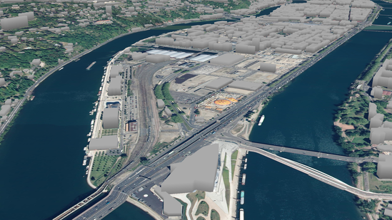

The goal of this tutorial is to give a brief example on how to use iTowns to visualize some vector data as 3D objects.
The vector data we will use in this tutorial represent buildings and will be displayed on the `GlobeView` we created in the [WGS84 tutorial]{@tutorial Raster-data-WGS84}.

## Preparing the field

To display our buildings, we are going to use the data created in the [WGS84 tutorial]{@tutorial Raster-data-WGS84}. As we are trying to display some buildings,
let's move closer to the ground to see something and let's give the camera an initial rotation. 
For this, we need to change the starting position to something more appropriate. We also need to modify the elevation
layer to a more precise one.

```html
<!DOCTYPE html>
<html>
    <head>
        <meta charset="UTF-8">
        <title>Vector data in 3D</title>
        <style>
            html { height: 100%; }
            body { margin: 0; overflow: hidden; height: 100%; }
            #viewerDiv { margin: auto; height: 100%; width: 100%; padding: 0; }
            canvas { display: block }
        </style>
     </head>
     <body>
        <div id="viewerDiv"></div>
        <script src="../dist/itowns.js"></script>
        <script type="text/javascript">
            var viewerDiv = document.getElementById('viewerDiv');
            var placement = {
                coord: new itowns.Coordinates('EPSG:4326', 4.818, 45.7354),
                range: 1000,
                tilt: 20,
            };
            var view = new itowns.GlobeView(viewerDiv, placement);
            
            var colorSource = new itowns.WMTSSource({
                url: 'http://wxs.ign.fr/decouverte/geoportail/wmts',
                crs: 'EPSG:3857',
                name: 'ORTHOIMAGERY.ORTHOPHOTOS',
                tileMatrixSet: 'PM',
                format: 'image/jpeg'
            });
            
            var colorLayer = new itowns.ColorLayer('Ortho', {
                source: colorSource,
            });
            
            view.addLayer(colorLayer);
            
            var elevationSource = new itowns.WMTSSource({
                url: 'http://wxs.ign.fr/altimetrie/geoportail/wmts',
                crs: 'EPSG:4326',
                name: 'ELEVATION.ELEVATIONGRIDCOVERAGE.HIGHRES',
                tileMatrixSet: 'WGS84G',
                format: 'image/x-bil;bits=32',
                tileMatrixSetLimits: {
                    11: {
                        minTileRow: 442,
                        maxTileRow: 1267,
                        minTileCol: 1344,
                        maxTileCol: 2683
                    },
                    12: {
                        minTileRow: 885,
                        maxTileRow: 2343,
                        minTileCol: 3978,
                        maxTileCol: 5126
                    },
                    13: {
                        minTileRow: 1770,
                        maxTileRow: 4687,
                        minTileCol: 7957,
                        maxTileCol: 10253
                    },
                    14: {
                        minTileRow: 3540,
                        maxTileRow: 9375,
                        minTileCol: 15914,
                        maxTileCol: 20507
                    }
                }
            });
            
            var elevationLayer = new itowns.ElevationLayer('MNT_WORLD', {
                source: elevationSource,
            });
            
            view.addLayer(elevationLayer);
        </script>
     </body>
</html>
```

## Adding a GeometryLayer

We will use a WFS stream that provides buildings footprints geometries and altitude information for each building. 
We will display the buildings by extruding the building footprints to the altitude value. iTowns provides a specific
layer for such usecases: `{@link FeatureGeometryLayer}` (which is a pre-configured type of `{@link GeometryLayer}`).
Before creating this layer, let's instantiate the data source:

```js

var geometrySource = new itowns.WFSSource({
    url: 'https://wxs.ign.fr/topographie/geoportail/wfs?',
    version: '2.0.0',
    typeName: 'BDTOPO_V3:batiment',
    crs: 'EPSG:4326',
    ipr: 'IGN',
    format: 'application/json',
});

```

With our source instantiated, we can create our `FeatureGeometryLayer`, giving it the usual `id` and `source` parameters :

```js
var geometryLayer = new itowns.FeatureGeometryLayer('Buildings', {
    source: geometrySource,
    zoom: { min: 14 },
});

view.addLayer(geometryLayer);
```

We also added a minimal `zoom` parameter to prevent our data being displayed before a certain 
zoom level at which we would be too far from the data to distinguish the buildings.

Trying this code will result visually in the following.


We can see the polygons fetched from the data source, each representing a building.
However, these polygons are not yet placed on the ground.
Indeed, they were placed after the 3D positions stored in the data, which in our case represent points on the roof of buildings.
So let's start modifying these polygons' altitude to place them on the ground !

## Placing the data on the ground

To achieve the positioning relative to the elevation layer, we will need to add
a parameter to the `FeatureGeometryLayer`, which is its `{@link Style}`.
As mentioned in the [fundamentals]{@tutorial Fundamentals} tutorial, we can modify the appearance and positioning of polygons thanks to the `fill` property of `Style`.
The altitude at which polygons are displayed can be modified using the `base_altitude` parameter, which we set as follows :

```js
function setAltitude(properties) {
    console.log(properties);
}

var geometrySource = new itowns.WFSSource({
    url: 'https://wxs.ign.fr/topographie/geoportail/wfs?',
    version: '2.0.0',
    typeName: 'BDTOPO_V3:batiment',
    crs: 'EPSG:4326',
    ipr: 'IGN',
    format: 'application/json',
});

var geometryLayer = new itowns.FeatureGeometryLayer('Buildings', {
    source: geometrySource,
    zoom: { min: 14 },
    style: new itowns.Style({
        fill: {
            base_altitude: setAltitude,
        }
    }),
});

view.addLayer(geometryLayer);
```

If we take a look using `console.log(properties);` at what we have in the
`properties` object, we will get a lot of output. Our data being constituted of
multiple buildings, we get an output for each building. Looking closer to an
output, here is what we can obtain :

```js
geometry_name: "the_geom"
hauteur: 9
id: "bati_indifferencie.19138409"
origin_bat: "Cadastre"
prec_alti: 5
prec_plani: 2.5
z_max: 83.7
z_min: 83.7
```

Reading the documentation of the database we are querying ([section 7.2, page
66](https://geoservices.ign.fr/sites/default/files/2023-01/DC_BDTOPO_3-3.pdf), in French), we have an
explanation on each property. To help us place the data correctly, let's use the
`altitude_minimale_sol` property. 
It corresponds to the minimal altitude of the building floor.

```js
function setAltitude(properties) {
    return properties.altitude_minimale_sol;
}
```
Now we can't see completely our buildings. What can we do about that
? Let's give them volume !


## Extruding the data

Like the altitude, the volume of buildings can be changed using the `extrusion_height`
parameter of the `Style.fill` property.

```js
function setExtrusion(properties) {
    return properties.hauteur;
}

var geometrySource = new itowns.WFSSource({
    url: 'https://wxs.ign.fr/topographie/geoportail/wfs?',
    version: '2.0.0',
    typeName: 'BDTOPO_V3:batiment',
    crs: 'EPSG:4326',
    ipr: 'IGN',
    format: 'application/json',
});

var geometryLayer = new itowns.FeatureGeometryLayer('Buildings', {
    source: geometrySource,
    zoom: { min: 14 },
    style: new itowns.Style({
        fill: {
            base_altitude: setAltitude,
            extrusion_height: setExtrusion,
        }
    }),
});

view.addLayer(geometryLayer);
```

The parameter `properties` of the `setExtrusion` method is the same as in
`setAltitude`. We noticed there is a `hauteur` (height) property that
we could use to set the height of the building. Moving around with this gives a
nice view of our buildings :


## Coloring the data

We are not yet touching the color of the buildings. This results in every
building being randomly colored at each time. To solve this, as we did before,
we can add a `color` parameter to the `Style.fill` property.

```js
function setColor(properties) {
    return new itowns.THREE.Color(0xaaaaaa);
}

var geometrySource = new itowns.WFSSource({
    url: 'https://wxs.ign.fr/topographie/geoportail/wfs?',
    version: '2.0.0',
    typeName: 'BDTOPO_V3:batiment',
    crs: 'EPSG:4326',
    ipr: 'IGN',
    format: 'application/json',
});

var geometryLayer = new itowns.FeatureGeometryLayer('Buildings', {
    source: geometrySource,
    zoom: { min: 14 },
    style: new itowns.Style({
        fill: {
            color: setColor,
            base_altitude: setAltitude,
            extrusion_height: setExtrusion,
        },
    }),
});

view.addLayer(geometryLayer);
```

For each building, a new color is created (using `THREE.Color`), and this results
in all buildings being colored in a light gray.



## Result

Congratulations ! By reaching here, we know how to display a simple `FeatureGeometryLayer` 
on a `GlobeView`, and change the appearance and positioning of this layer. Here is the final code:

```html
<!DOCTYPE html>
<html>
    <head>
        <meta charset="UTF-8">
        <title>Vector data in 3D</title>
        <style>
            html { height: 100%; }
            body { margin: 0; overflow: hidden; height: 100%; }
            #viewerDiv { margin: auto; height: 100%; width: 100%; padding: 0; }
            canvas { display: block }
        </style>
     </head>
     <body>
        <div id="viewerDiv"></div>
        <script src="../dist/itowns.js"></script>
        <script type="text/javascript">
            var viewerDiv = document.getElementById('viewerDiv');
            var placement = {
                coord: new itowns.Coordinates('EPSG:4326', 4.818, 45.7354),
                range: 1E3,
                tilt: 20,
            };
            var view = new itowns.GlobeView(viewerDiv, placement);

            var colorSource = new itowns.WMTSSource({
                url: 'http://wxs.ign.fr/decouverte/geoportail/wmts',
                crs: 'EPSG:3857',
                name: 'ORTHOIMAGERY.ORTHOPHOTOS',
                tileMatrixSet: 'PM',
                format: 'image/jpeg'
            });

            var colorLayer = new itowns.ColorLayer('Ortho', {
                source: colorSource,
            });

            view.addLayer(colorLayer);

            var elevationSource = new itowns.WMTSSource({
                url: 'http://wxs.ign.fr/altimetrie/geoportail/wmts',
                crs: 'EPSG:4326',
                name: 'ELEVATION.ELEVATIONGRIDCOVERAGE.HIGHRES',
                tileMatrixSet: 'WGS84G',
                format: 'image/x-bil;bits=32',
                tileMatrixSetLimits: {
                    11: {
                        minTileRow: 442,
                        maxTileRow: 1267,
                        minTileCol: 1344,
                        maxTileCol: 2683
                    },
                    12: {
                        minTileRow: 885,
                        maxTileRow: 2343,
                        minTileCol: 3978,
                        maxTileCol: 5126
                    },
                    13: {
                        minTileRow: 1770,
                        maxTileRow: 4687,
                        minTileCol: 7957,
                        maxTileCol: 10253
                    },
                    14: {
                        minTileRow: 3540,
                        maxTileRow: 9375,
                        minTileCol: 15914,
                        maxTileCol: 20507
                    }
                }
            });

            var elevationLayer = new itowns.ElevationLayer('MNT_WORLD', {
                source: elevationSource,
            });

            view.addLayer(elevationLayer);

            function setAltitude(properties) {
                return properties.altitude_minimale_sol;
            }

            function setExtrusion(properties) {
                return properties.hauteur;
            }

            function setColor(properties) {
                return new itowns.THREE.Color(0xaaaaaa);
            }

          
            var geometrySource = new itowns.WFSSource({
                url: 'https://wxs.ign.fr/topographie/geoportail/wfs?',
                version: '2.0.0',
                typeName: 'BDTOPO_V3:batiment',
                crs: 'EPSG:4326',
                ipr: 'IGN',
                format: 'application/json',
            });

            var geometryLayer = new itowns.FeatureGeometryLayer('Buildings', {
                source: geometrySource,
                zoom: { min: 14 },
                style: new itowns.Style({
                    fill: {
                        color: setColor,
                        base_altitude: setAltitude,
                        extrusion_height: setExtrusion,
                    },
                }),
            });

            view.addLayer(geometryLayer);
        </script>
     </body>
</html>
```
