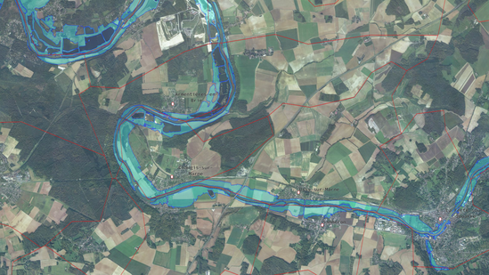

The goal of this tutorial is to give an example on how to use iTowns to visualize some vector data projected on the ground.
These data are contained within two GeoJSON files that you can find 
[here](https://raw.githubusercontent.com/iTowns/iTowns2-sample-data/master/multipolygon.geojson) and 
[here](https://raw.githubusercontent.com/iTowns/iTowns2-sample-data/master/cities.geojson).
The first file data consist in polygons which represent flood risk areas along the Marne river.
The second file data consist in polygons which delimit city areas, and points at the center of some cities.
These data shall be displayed on the `GlobeView` we created in the [WGS84 tutorial]{@tutorial Raster-data-WGS84}.

## Preparing the field

We are going to use the data displayed in the [WGS84 tutorial]{@tutorial Raster-data-WGS84}.
However, we want the camera to be closer to the area our vector data will occupy.
We need to change the starting position to something more appropriate.

```html
<!DOCTYPE html>
<html>
    <head>
        <meta charset="UTF-8">
        <title>Vector data on ground</title>
        <style>
            html { height: 100%; }
            body { margin: 0; overflow: hidden; height: 100%; }
            #viewerDiv { margin: auto; height: 100%; width: 100%; padding: 0; }
            canvas { display: block }
        </style>
    </head>
    <body>
        <div id="viewerDiv"></div>
        <script src="../dist/itowns.js"></script>
        <script type="text/javascript">
            
            // Retrieve the view container
            var viewerDiv = document.getElementById('viewerDiv');
            
            // Define the camera initial placement
            var placement = {
                coord: new itowns.Coordinates('EPSG:4326', 3.05, 48.97),
                range: 15000,
            };
            
            // Create the view
            var view = new itowns.GlobeView(viewerDiv, placement);
            
            // Define the source of the ortho-images
            var orthoSource = new itowns.WMTSSource({
                url: 'https://wxs.ign.fr/decouverte/geoportail/wmts',
                crs: "EPSG:3857",
                name: 'ORTHOIMAGERY.ORTHOPHOTOS',
                tileMatrixSet: 'PM',
                format: 'image/jpeg',
            })
            // Create the ortho-images ColorLayer and add it to the view
            var orthoLayer = new itowns.ColorLayer('Ortho', {
                source: orthoSource,
            });
            view.addLayer(orthoLayer);
            
            // Define the source of the dem data
            var elevationSource = new itowns.WMTSSource({
                url: 'https://wxs.ign.fr/altimetrie/geoportail/wmts',
                crs: 'EPSG:4326',
                name: 'ELEVATION.ELEVATIONGRIDCOVERAGE.SRTM3',
                tileMatrixSet: 'WGS84G',
                format: 'image/x-bil;bits=32',
                zoom: {min: 3, max: 10},
            });
            // Create the DEM ElevationLayer and add it to the view
            var elevationLayer = new itowns.ElevationLayer('DEM', {
                source: elevationSource,
            });
            view.addLayer(elevationLayer);
        </script>
    </body>
</html>
```

## Display flood risk areas on the ground

The first mandatory thing we need to do for our flood area vector data to be displayed is to define their source.
Our data is contained within a GeoJSON file, so we can use iTowns `{@link FileSource}` :

```js
var floodSource = new itowns.FileSource({
    url: 'https://raw.githubusercontent.com/iTowns/iTowns2-sample-data/master/multipolygon.geojson',
    crs: 'EPSG:4326',
    format: 'application/json',
});
```

We give three arguments to our `FileSource`, which are pretty self-explanatory. 
The `url` and `crs` define the URL at which our file can be found, and the Coordinates Reference System (CRS) of the data contained within the file.
The `format` parameter defines the format of our file. 
Itowns needs this format to determine which method it shall use to download data and transform them into iTowns internal objects.

Now that the source of our vector data is set, we need to create a `Layer` which will contain the data.
We want our vector data to be projected on the ground. Therefore, we use a `{@link ColorLayer}` and add it to our `GlobeView` :

```js
var floodLayer = new itowns.ColorLayer('flood', {
    source: floodSource,
});
view.addLayer(floodLayer);
```

If you run the example now, you will notice that nothing is displayed yet.
That is because we did not yet define a `{@link Style}` for our vector data. 
To be more precise, our data consists in polygons, and we did not tell iTowns how these polygons should be displayed, so iTowns doesn't display them.
We can correct this by creating a `{@link Style}` and applying it to our `ColorLayer` :

```js
var floodStyle = {
    fill: {
        color: 'cyan',
        opacity: 0.5,
    },
    stroke: {
        color: 'blue',
    },
};

var floodLayer = new itowns.ColorLayer('flood', {
    source: floodSource,
    style: floodStyle,
});
```

In this code sample, we simply told iTowns to color all polygons' interior (accessed with the `fill` parameter) in cyan with a 50% transparency.
We also told iTowns to color the edges of the polygons (accessed with the `stroke` parameter) in blue.
The result is the following :


## Display city areas and names

The process of displaying data about city areas and city names is almost exactly the same as for the flood areas.
We must first define the source of our data (a GeoJSON file in our case) :

```js
var citySource = new itowns.FileSource({
    url: 'https://raw.githubusercontent.com/iTowns/iTowns2-sample-data/master/cities.geojson',
    crs: 'EPSG:4326',
    format: 'application/json',
});
```

Then we can define the `Style` with which our data shall be displayed :

```js
var cityStyle = {
    stroke: {
        color: 'red',
    },
    point: {
        color: 'white',
        line: 'red',
        radius: 3,
    },
    text: {
        field: '{name}',
        anchor: 'bottom-left',
        size: 18,
        haloColor: 'white',
        haloWidth: 1,
        font: ['monospace'],
    },
};
```

Here, we decided of the following style concerning the content of our data :
- Polygons' edges shall be colored in red. 
- Points shall be displayed as a white circle with red edges, and with a radius of 3 pixels.
- Labels attached to points shall contain what is stored under the `name` property in the GeoJSON data.
  They shall be written in a `'monospace'` font and in a given size, with white halo around each letter.
  The labels shall be placed so that the position of the point matches with the bottom left corner of the label.

Finally, we can create a `ColorLayer` that will contain the data source we created, and add it to the view :

```js
var cityLayer = new itowns.ColorLayer('cities', {
    source: citySource,
    style: cityStyle,
    addLabelLayer: true,
});
view.addLayer(cityLayer);
```

As you may have noticed, we added a parameter to the `ColorLayer`, which is `addLabelLayer`. 
This parameter needs to be set to true if we want to display labels on the `ColorLayer`.
Had we left it to false, only the points and polygons would have been displayed on our `ColorLayer`. 

The result is the following :



## Result

By reaching here, you are now able to display simple vector data projected on the ground. The final code to do so is the following :

```html
<!DOCTYPE html>
<html>
    <head>
        <meta charset="UTF-8">
        <title>Vector data on ground</title>
        <style>
            html { height: 100%; }
            body { margin: 0; overflow: hidden; height: 100%; }
            #viewerDiv { margin: auto; height: 100%; width: 100%; padding: 0; }
            canvas { display: block }
        </style>
    </head>
    <body>
        <div id="viewerDiv"></div>
        <script src="../dist/itowns.js"></script>
        <script type="text/javascript">

            // Retrieve the view container
            var viewerDiv = document.getElementById('viewerDiv');

            // Define the camera initial placement
            var placement = {
                coord: new itowns.Coordinates('EPSG:4326', 3.05, 48.97),
                range: 15000,
            };

            // Create the view
            var view = new itowns.GlobeView(viewerDiv, placement);

            // Define the source of the ortho-images
            var orthoSource = new itowns.WMTSSource({
                url: 'https://wxs.ign.fr/decouverte/geoportail/wmts',
                crs: "EPSG:3857",
                name: 'ORTHOIMAGERY.ORTHOPHOTOS',
                tileMatrixSet: 'PM',
                format: 'image/jpeg',
            })
            // Create the ortho-images ColorLayer and add it to the view
            var orthoLayer = new itowns.ColorLayer('Ortho', {
                source: orthoSource,
            });
            view.addLayer(orthoLayer);

            // Define the source of the dem data
            var elevationSource = new itowns.WMTSSource({
                url: 'https://wxs.ign.fr/altimetrie/geoportail/wmts',
                crs: 'EPSG:4326',
                name: 'ELEVATION.ELEVATIONGRIDCOVERAGE.SRTM3',
                tileMatrixSet: 'WGS84G',
                format: 'image/x-bil;bits=32',
                zoom: {min: 3, max: 10},
            });
            // Create the DEM ElevationLayer and add it to the view
            var elevationLayer = new itowns.ElevationLayer('DEM', {
                source: elevationSource,
            });
            view.addLayer(elevationLayer);
            
            // Define the source of the flood area data
            var floodSource = new itowns.FileSource({
                url: 'https://raw.githubusercontent.com/iTowns/iTowns2-sample-data/master/multipolygon.geojson',
                crs: 'EPSG:4326',
                format: 'application/json',
            });
            
            // Define a style for the flood area data
            var floodStyle = {
                fill: {
                    color: 'cyan',
                    opacity: 0.3,
                },
                stroke: {
                    color: 'blue',
                },
            };
            
            // Create the flood area ColorLayer and add it to the view
            var floodLayer = new itowns.ColorLayer('flood', {
                source: floodSource,
                style: floodStyle,
            });
            view.addLayer(floodLayer);
            
            // Define the source of the city data
            var citySource = new itowns.FileSource({
                url: 'https://raw.githubusercontent.com/iTowns/iTowns2-sample-data/master/cities.geojson',
                crs: 'EPSG:4326',
                format: 'application/json',
            });
            
            // Define a style for the city data
            var cityStyle = {
                stroke: {
                    color: 'red',
                },
                point: {
                    color: 'white',
                    line: 'red',
                    radius: 3,
                },
                text: {
                    field: '{name}',
                    anchor: 'bottom-left',
                    size: 18,
                    haloColor: 'white',
                    haloWidth: 1,
                    font: ['monospace'],
                },
            };
            
            // Create the city data ColorLayer and add it to the view
            var cityLayer = new itowns.ColorLayer('cities', {
                source: citySource,
                style: cityStyle,
                addLabelLayer: true,
            });
            view.addLayer(cityLayer);
        </script>
    </body>
</html>
```
